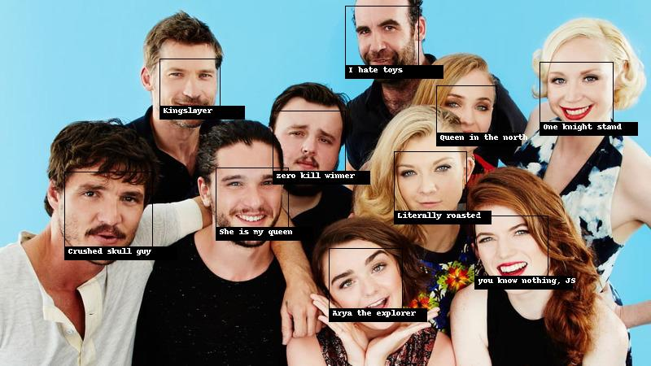

# FindFace.py

# Face Recognition using Python and Pillow

## Installation
  * [Install dlib](https://gist.github.com/ageitgey/629d75c1baac34dfa5ca2a1928a7aeaf)
  * [Install Face_recognition library using PIP](https://pypi.org/project/face_recognition/)
  
## Prerequisites
  * A collection of pictures on which you'll train your model (i.e database of known persons).
  * A Octa-core CPU, because if you are trying to train lots of pictures, It's gonna cost you more time. So more the merrier.
  * The picture of who we are trying to identify (duh).

### Basically next steps are self explanatory if you have minimum python experience.
  
## Input 

## Output

#### P.S: That's how I named them. :D
